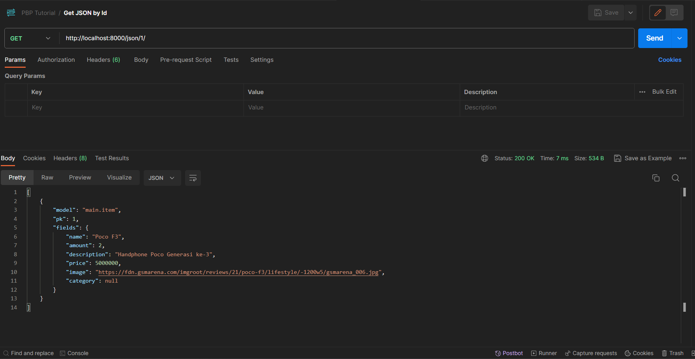
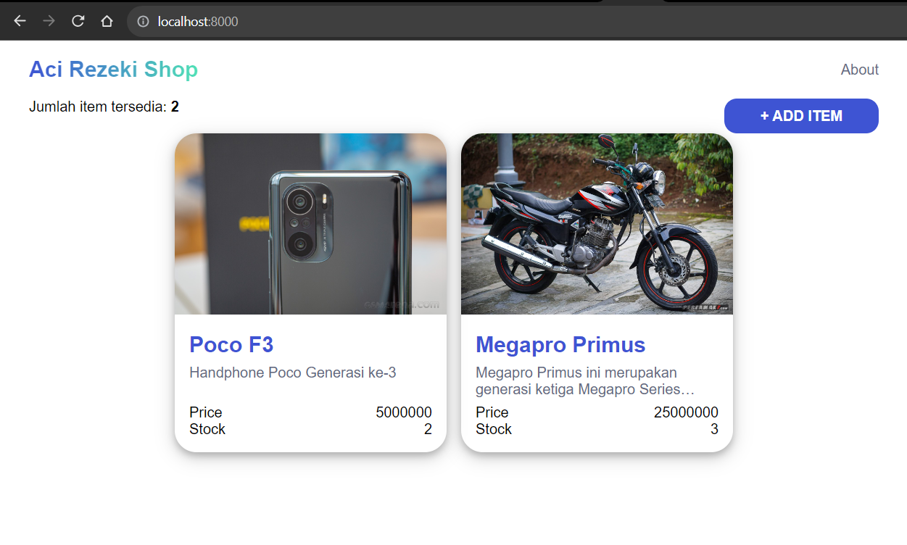

# Tugas PBP : Aci Rezeki Shop

Web application : [https://aci-rezeki-shop.ilhamelhamdi.com](https://aci-rezeki-shop.ilhamelhamdi.com)

## Daftar Isi

-   [Tugas 5](#tugas-5)
    -   [Manfaat dan Penggunaan yang Tepat dari _Element Selector_](#manfaat-dan-penggunaan-yang-tepat-dari-element-selector)
    -   [Penjelasan HTML5 Tag](#penjelasan-html5-tag)
    -   [Perbedaan Margin dan Padding](#perbedaan-margin-dan-padding)
    -   [Perbedaan dan _Use Case_ Penggunaan _Framework_ CSS Bootstrap dan Tailwind](#perbedaan-dan-use-case-penggunaan-framework-css-bootstrap-dan-tailwind)
    -   [Implementasi Step-by-Step](#implementasi-step-by-step-tugas-5)
-   [Tugas 4](#tugas-4)
    -   [UserCreationForm Django](#usercreationform-django)
    -   [Perbedaan Autentikasi dan Otorisasi](#perbedaan-autentikasi-dan-otorisasi)
    -   [_Cookies_ dalam Pengelolaan _Session_](#cookies-dalam-pengelolaan-session)
    -   [Masalah Keamanan dan Risiko Penggunaan _Cookies_](#masalah-keamanan-dan-risiko-penggunaan-cookies)
    -   [Implementasi Step-by-Step](#implementasi-step-by-step-tugas-4)
-   [Tugas 3](#tugas-3)
    -   [Perbedaan Form POST dan Form GET](#perbedaan-form-post-dan-form-get)
    -   [Perbedaan XML, JSON, dan HTML dalam _Data Delivery_](#perbedaan-xml-json-dan-html-dalam-data-delivery)
    -   [Alasan JSON Lebih Populer Digunakan dalam _Data Delivery_](#alasan-json-lebih-populer-digunakan-dalam-data-delivery)
    -   [Implementasi Step-by-Step](#implementasi-step-by-step-tugas-3)
    -   [Screenshot Postman](#screenshot-postman)
    -   [Bonus](#bonus-tugas-3)
-   [Tugas 2](#tugas-2)
    -   [Implementasi Step-by-Step](#implementasi-step-by-step-tugas-2)
    -   [Cara Kerja Implementasi Konsep MTV pada Django](#cara-kerja-implementasi-konsep-mtv-pada-django)
    -   [Alasan Penggunaan Virtual Environment](#alasan-penggunaan-virtual-environment)
    -   [Konsep MVC, MVT, dan MVVM](#konsep-mvc-mvt-dan-mvvm)

<!-- ================ TUGAS 5 BEGIN ================== -->
<details open>
<summary><h1 id="tugas-5">Tugas 5</h1></summary>

## Manfaat dan Penggunaan yang Tepat dari _Element Selector_

CSS _element selector_ atau _tag selector_ berfungsi untuk memilih semua elemen dengan jenis tag yang sama di dalam dokumen HTML, seperti `<p>` atau `<div>`. Setiap elemen dalam HTML memiliki jenis tag yang berbeda. Dengan menggunakan _element selector_, kita dapat mengatur style CSS untuk semua elemen dengan jenis tag yang sama secara bersamaan. Hal ini tentunya dapat menghemat waktu dan usaha dalam mengatur style CSS. Selain itu, _selector element_ juga dapat digunakan untuk mengatur style CSS untuk elemen yang belum memiliki _class_ atau _id_.

_Element selector_ lebih baik digunakan saat kita membutuhkan kustomisasi secara universal untuk elemen-elemen dengan tag yang sama. Misalnya, kita ingin mengubah _default style_ tag `<a>` sehingga ditampilkan tanpa ada _underline_. Dengan menggunakan _element selector_, kita dapat mengubah style tag `<a>` secara universal tanpa perlu menambahkan _class_ atau _id_ pada tag `<a>` tersebut. Berikut merupakan kode CSS untuk contoh tersebut.

```css
a {
    text-decoration: none;
}
```

## Penjelasan HTML5 Tag

HTML5 adalah versi terbaru dari HTML. Kini, HTML5 menyediakan beberapa tag elemen baru yang bersifat lebih _semantic_. Elemen _semantic_ adalah elemen yang memiliki makna yang dapat dipahami oleh browser ataupun developer. Dengan menggunakan elemen _semantic_, kita dapat membuat struktur dokumen HTML yang lebih jelas dan mudah dibaca. Berikut beberapa tag elemen baru pada HTML5 beserta penjelasannya.


-   `<header>`

    Elemen `<header>` biasanya digunakan untuk merepresentasikan _container_ konten pendahuluan atau kumpulan link navigasi.

-   `<nav>`

    Elemen `<nav>` biasanya digunakan untuk merepresentasikan kumpulan link navigasi.

-   `<main>`

    Elemen `<main>` biasanya digunakan untuk merepresentasikan _container_ konten utama dari sebuah dokumen.

-   `<section>`

    Elemen `<section>` berfungsi untuk mendefinisikan bagian tertentu dari dokumen HTML. Misalnya, tag `<section>` digunakan untuk memisahkan bagian _introduction_, _contact information_, _details_, dan lain-lain. Berdasarkan dokumentasi W3C, "A section is a thematic grouping of content, typically with a heading."

-   `<article>`
    
    Elemen `<article>` biasanya berisi konten independen yang tidak memerlukan konteks lain di luar elemen tersebut.

-   `<aside>`
    
    Elemen ini biasanya ditempatkan disamping _container_ konten utama. Elemen ini biasanya berisi konten yang berhubungan dengan konten utama, namun tidak terlalu penting untuk dibaca. Misalnya, elemen ini biasanya berisi konten seperti _sidebar_, _advertisements_, _related articles_, dan lain-lain.

-   `<footer>`
    
    Elemen `<footer>` biasanya digunakan untuk merepresentasikan _container_ konten penutup, seperti informasi _copyright_, informasi kontak, link yang berkaitan, atau link untuk kembali ke atas dokumen.

-   `<figure>`
    
    Elemen `<figure>` biasanya digunakan untuk merepresentasikan konten yang berdiri sendiri, seperti gambar, ilustrasi, diagram, _code snippet_, dan lain-lain.

Referensi: [https://www.w3schools.com/html/html5_semantic_elements.asp](https://www.w3schools.com/html/html5_semantic_elements.asp)

## Perbedaan Margin dan Padding

Margin dan padding merupakan konsep dalam CSS yang berguna untuk mengatur jarak antara elemen HTML. Margin adalah jarak antara elemen HTML dan elemen lain di sekitarnya, sedangkan padding adalah jarak antara konten elemen HTML dan batas elemen tersebut. Margin menciptakan **ruang kosong di luar elemen**, sementara padding menciptakan **ruang kosong di dalam elemen**. Berikut ilustrasi perbedaan margin dan padding.

Berikut merupakan ilustrasi **margin** dan bagaimana margin berefek pada elemen di sekitarnya (misalkan margin = 10px):


Berikut merupakan ilustrasi padding dan bagaimana padding berefek pada konten elemen tersebut (misalkan padding-x = 10px & padding-y = 15px):


## Perbedaan dan _Use Case_ Penggunaan _Framework_ CSS Bootstrap dan Tailwind

Bootstrap dan Tailwind merupakan _framework_ CSS yang dapat digunakan untuk memberikan kemudahan dalam melakukan _styling_ web. Keduanya sama-sama menyediakan _class_ CSS yang dapat digunakan untuk mengatur tampilan web. Namun meskipun keduanya sama-sama _framework_ CSS, keduanya berbeda dari sisi cara kerja dan penggunaannya.

_Framework_ Bootstrap menyediakan berbagai _pre-defined class_ dan template CSS yang siap pakai. Dengan menggunakan _class_ yang disediakan Bootstrap, tampilan website akan lebih terstruktur dan konsisten. Kita hanya perlu menambahkan _class_ CSS yang telah disediakan oleh Bootstrap ke elemen HTML yang ingin diatur tampilannya. Selain itu, _styling_ beberapa komponen yang umum digunakan dalam website juga telah disediakan oleh Bootstrap, seperti _form_, _button_, _card_, _carousel_, _modal_, _dropdown_, dll. Dengan pendekatan ini, Bootstrap dapat digunakan dengan mudah oleh pengguna yang tidak memiliki pengetahuan yang mendalam tentang CSS. Namun, Bootstrap memiliki kekurangan dalam hal _customization_. Karena Bootstrap hanya menyediakan _class_ CSS yang telah ditentukan, kita tidak dapat melakukan _customization_ yang mendalam terhadap tampilan web kita.

Adapun _framework_ Tailwind CSS menggunakan pendekatan _utility-first_ untuk mendefinisikan berbagai _class_-nya. Dengan pendekatan ini, Tailwind CSS menyediakan berbagai _class_ CSS yang memiliki fungsi kecil atau sederhana yang dapat digabungkan untuk membuat _styling_ yang lebih kompleks. Selain itu, penggunaan Tailwind CSS juga membuat proses _styling_ lebih cepat karena developer dapat menerapkan _style_ secara langsung di dalam dokumen HTML, tanpa perlu bolak-balik antara dokumen HTML dan CSS. Dengan pendekatan ini, Tailwind CSS dapat digunakan untuk melakukan _customization_ yang mendalam terhadap tampilan web. Namun, Tailwind CSS memiliki kekurangan dalam hal _readability_. Karena Tailwind CSS menggunakan pendekatan _utility-first_, kode CSS yang dihasilkan akan terlihat sangat panjang dan sulit dibaca. Selain itu, Tailwind CSS juga tidak menyediakan _pre-defined CSS class_ untuk komponen-komponen umum seperti Bootstrap.

_Framework_ Bootstrap lebih baik digunakan untuk membuat website yang memiliki **tampilan yang sederhana, konsisten dan tidak memerlukan _customization_ yang mendalam**. Sedangkan _framework_ Tailwind CSS lebih baik digunakan untuk membuat website yang memiliki **tampilan yang unik dan memerlukan _customization_ yang mendalam**.

## Implementasi Step-by-Step (Tugas 5)

-   Menambahkan konfigurasi static file pada `settings.py`
    ```py
    ...
    STATIC_URL = 'static/'
    ...
    ```
-   Membuat folder `static` di dalam folder aplikasi `main`
-   Membuat folder `css` di dalam folder `static`
-   Membuat file css untuk masing-masing halaman template
    -   `global.css` (untuk styling global)
    -   `login.css`
    -   `register.css`
    -   `index.css`
    -   `create_item.css`
    -   `item_by_id.css`
    -   `form.css` (untuk styling form)
-   Menghubungkan masing-masing file css dengan template yang sesuai dengan menggunakan tag `<link>` pada bagian `<head>` template. Berikut merupakan salah satu kodenya.
    ```html
     
    ...
    
        <link rel="stylesheet" href="" />
     
    ...
    ```
-   Membuat _styling_ untuk form pada `form.css` untuk mengatur tampilan form secara global agar lebih konsisten. Berikut merupakan kode CSS-nya
    ```css
    form {
        width: 480px;
        margin: 0 auto;
    }

    form div {
        display: flex;
        flex-direction: column;
        margin-bottom: 1rem;
    }

    form label {
        margin-bottom: 4px;
    }

    form input,
    form textarea,
    form select {
        padding: 8px 16px;
        border-radius: 6px;
        font-size: medium;
        font-family: sans-serif;
        border: none;
        outline: none;
        background-color: rgb(240 240 243);
    }

    form input:focus,
    form textarea:focus,
    form select:focus {
        background-color: white;
        outline: rgb(240 240 243) solid 3px;
    }

    form textarea {
        height: 3rem;
        resize: vertical;
    }

    .form-header {
        text-align: center;
        margin-bottom: 1rem;
        color: var(--primary-color);
    }

    .form-footer {
        text-align: center;
    }

    .form-wrapper {
        box-shadow: 0 4px 8px 0 rgba(0, 0, 0, 0.2), 0 6px 20px 0 rgba(0, 0, 0, 0.19);
        width: fit-content;
        padding: 2rem 4rem;
        margin: auto auto;
        border-radius: 2rem;
        min-height: 60%;
        display: flex;
        flex-direction: column;
        justify-content: space-between;
    }

    ```
-   Kustomisasi halaman login
    -   Mengubah struktur halaman login. Berikut merupakan struktur HTML pada bagian `<body>` halaman login.
        ```html
        
        <section class="form-wrapper">
            <h1 class="form-header">Login</h1>
            <form method="POST">
                
                <div>
                <label for="username">Username</label>
                <input type="text" id="username" name="username" autocomplete="username" required autofocus>
                </div>
                <div>
                <label for="password">Password</label>
                <input type="password" id="password" name="password" autocomplete="password" required>
                </div>
                <div class="submit-wrapper">
                <input type="submit" value="LOGIN" class="btn-primary" />
                </div>
            </form>
            <p class="form-footer">New to Aci Rezeki Shop? <a href="/register/">Create an account</a></p>
        </section>
        
        ```
    -   Mengubah style halaman login. Karena _style_ untuk form sudah diimplementasi pada `form.css`, maka kita cukup import _style_ dari `form.css` ke `login.css`. Berikut merupakan kodenya.
        ```css
            @import "form.css";
        ```
    -   Berikut merupakan tampilan halaman login setelah diimplementasi _style_.
        

-   Kustomisasi halaman register
    -   Mengubah struktur halaman register sesuai dengan yang diinginkan. Berikut merupakan struktur HTML pada bagian `<body>` halaman register.
        ```html
        
        <section class="form-wrapper">
        <h1 class="form-header">Register</h1>
        <form method="POST">
            
            {{ form.as_div }}
            <div class="submit-wrapper">
            <input type="submit" value="REGISTER" class="btn-primary" />
            </div>
        </form>
        <p class="form-footer">Already have an account? <a href="/login/">Login</a></p>
        </section>
        
        ```
    -   Mengubah style halaman register. Karena _style_ untuk form sudah diimplementasi pada `form.css`, maka kita cukup import _style_ dari `form.css` ke `register.css`. Berikut merupakan kodenya.
        ```css
            @import "form.css";
        ```
    -   Berikut merupakan tampilan halaman register setelah diimplementasi _style_.
        

-   Kustomisasi halaman _create item_
    -   Mengubah struktur halaman _create item_ sesuai dengan yang diinginkan. Berikut merupakan struktur HTML pada bagian `<body>` halaman register.
        ```html
            
            <section class="form-wrapper">
            <h1 class="form-header">Add New Item</h1>

            <form method="POST">
                
                {{ form.as_div }}
                <div class="submit-wrapper">
                <input type="submit" value="SUBMIT" class="btn-primary" />
                </div>
            </form>
            </section>
            
        ```
    -   Mengubah style halaman _create item_. Karena _style_ untuk form sudah diimplementasi pada `form.css`, maka kita cukup import _style_ dari `form.css` ke `create_item.css`. Berikut merupakan kodenya.
        ```css
            @import "form.css";
        ```
    -   Berikut merupakan tampilan halaman _create item_ setelah diimplementasi _style_.
        

-   Kustomisasi halaman `index.html` (daftar inventori) dengan pendekatan penggunaan _Card_
    -  Membuat komponen _Card_ untuk menampilkan item dari inventori. Berikut kodenya.
        ```html
            <div class="item-card-wrapper">
                
                    <a href="/item/{{item.id}}" class="item-card shadow">
                        </img>
                        <div class="item-contents">
                            <p class="item-name">{{item.name}}</p>
                            <p class="item-description">{{item.description}}</p>
                            <div class="item-field">
                                <span>Price</span>
                                <span>Rp{{item.price|intcomma}}</span>
                            </div>
                            <div class="item-field">
                                <span>Stock</span>
                                <span>{{item.amount}}</span>
                            </div>
                        </div>
                    </a>
                
            </div>
        ```
        Penjelasan:
        Card tersebut merupakan elemen `<a>` yang apabila diklik akan mengarahkan user ke _path url_ detail item tersebut. Card tersebut terdiri dari beberapa komponen, yaitu gambar dan kontennya. Bagian konten berisi data nama, deskripsi singkat, harga, dan stok (amount) dari item inventori.
    -   Membuat _style_ untuk _Card_ tersebut di dalam file `index.css`. Berikut merupakan kodenya
        ```css
            #add-item-wrapper {
                display: flex;
                justify-content: space-between;
            }

            .item-card-wrapper {
                display: flex;
                flex-wrap: wrap;
                justify-content: center;
                gap: 1rem;
                margin-bottom: 2rem;
            }

            .item-card {
                display: block;
                width: 300px;
                height: fit-content;
                overflow: clip;
                border-radius: 1.5rem;
            }

            .item-image {
                display: inline-block;
                width: 100%;
                height: auto;
                object-fit: cover;
                aspect-ratio: 3 / 2;
            }

            .item-contents {
                padding: 1rem;
            }

            .item-name {
                font-size: 1.5rem;
                font-weight: bold;
                color: var(--primary-color);
            }

            .item-description {
                height: 36px;
                margin: 8px 0;
                overflow: hidden;
                text-overflow: ellipsis;
                display: -webkit-box;
                -webkit-line-clamp: 2;
                -webkit-box-orient: vertical;
            }

            .item-field {
                display: flex;
                justify-content: space-between;
                color: black;
            }
        ```
    
    -   Berikut merupakan hasil tampilan halaman `index.html` setelah diimplementasi _Card_.
        

<!-- ================ TUGAS 5 END ================== -->

<!-- ================ TUGAS 4 BEGIN ================== -->
<details>
<summary><h1 id="tugas-4">Tugas 4</h1></summary>

## `UserCreationForm` Django

_Class_ `UserCreationForm` merupakan salah satu _built-in class_ pada Django yang berfungsi untuk membuat form untuk pengisian data class `User` yang telah disediakan oleh Django dari Django. Form ini meneriman tiga input field, yaitu `username`, `password1`, dan `password2` (sebagai _confirmation password_). Kelebihannya menggunakan class ini adalah kemudahannya dalam membuat form user secara instans, karena telah disediakan langsung oleh Django. Hanya dengan instansiasi form tersebut, kita sudah dapat membuat form user sederhana. Namun, sayangnya apabila kita memerlukan beberapa _field_ lain yang lebih kompleks untuk class model `User`, `UserCreationForm` tidak bisa digunakan secara langsung karena tidak bisa dikustomisasi. Hal ini bisa diatasi dengan membuat form `User` baru yang meng-inherit `UserCreationForm` dan menambahkan beberapa _field_ yang dibutuhkan.

Referensi : [https://docs.djangoproject.com/en/4.2/topics/auth/default/](https://docs.djangoproject.com/en/4.2/topics/auth/default/)

## Perbedaan Autentikasi dan Otorisasi

Autentikasi merupakan proses verifikasi identitas seseorang. Salah satu contoh autentikasi adalah proses _login_. Sedangkan otorisasi adalah proses verifikasi apakah seseorang memiliki hak akses pada suatu objek, seperti file, aplikasi, atau data tertentu. Perbedaan keduanya terletak pada hal apa yang diverifikasi. Proses autentikasi berfokus pada siapa identitas user, sedangkan otorisasi berfokus pada apa saja yang dapat dilakukan user pada suatu objek. Pada umumnya, proses autentikasi dilakukan terlebih dahulu kemudian diikuti proses otorisasi.

Keduanya penting untuk diperhatikan dalam pembuatan aplikasi karena alasan keamanan. Tanpa autentikasi dan otorisasi, keamanan data sensitif milik pengguna menjadi tidak terjamin. Siapa saja dapat mengakses data sensitif tersebut. Dengan autentikasi, data tersebut dapat diasosiasikan kepada suatu identitas tertentu. Dengan otorisasi, hak akses data tersebut dapat dibatasi bagi orang-orang yang tidak berkepentingan.

## _Cookies_ dalam Pengelolaan _Session_

_Cookies_ merupakan file teks yang berisi suatu informasi yang dikirimkan web server ke client/browser. Umumnya, _cookies_ berfungsi sebagai kode tanda pengenal untuk _device_ client. Cookies biasanya digunakan oleh aplikasi web untuk menyimpan informasi yang dapat digunakan di masa mendatang.

Secara _default_, Django menggunakan _cookies_ untuk mengelola data sesi pengguna. Apabila pengguna melakukan _login_ pada aplikasi Django (_login_ menggunakan fungsi _login_ bawaan Django ), sebuah _cookie_ disimpan di browser. _Cookie_ ini berisi session id yang merupakan kode untuk mengidentifikasi pengguna. Untuk melakukan pengaturan _cookies_ dari sisi web server, kita dapat menggunakan method `set_cookies(key, value)` pada objek `HttpResponse` yang akan dikirim ke browser. Untuk membaca _cookies_ yang diterima dari client/browser, kita dapat menggunakan `request.COOKIES.get(key)`.

## Masalah Keamanan dan Risiko Penggunaan _Cookies_

_Cookies_ itu sendiri secara _default_ aman. Tidak seperti kode program, _cookies_ hanyalah sebuah teks data sehingga tidak dapat melakukan aktivitas berbahaya, seperti layaknya virus, worm, atau spyware. Pada umumnya, _cookies_ juga memiliki masa kadaluarsa sehingga akan terhapus dalam jangka waktu tertentu. Bahkan secara _default_, _session cookies_ akan terhapus apabila user menutup browser.
Namun, penggunaan _cookies_ memiliki beberapa risiko yang mesti diwaspadai. Jika tidak dikelola dengan baik, _cookies_ bisa menjadi potensi masalah keamanan. Berikut beberapa risiko penggunaan _cookies_ :

1.  Pelanggaran privasi
    Cookies dapat digunakan untuk melacak perilaku user secara online, termasuk pengunjungan situs web dan preferensi mereka. Dalam konteks ini, cookies berperan sebagai data perilaku pengguna. Biasanya cookies ini disediakan oleh pihak ketiga (selain pemilik website).
2.  Cross-site request forgery attack (XSRF)
    Penggunaan _cookies_ sebagai pengelola sesi pengguna juga berpotensi menimbulkan risiko serangang XSRF. _Persisten cookies_ yang berisi session id bisa saja dibaca oleh _malicious program_ dari aplikasi lain, kemudian melakukan aktivitas yang tidak diinginkan dengan _cookies_ yang telah dicuri tersebut.

## Implementasi Step-by-Step (Tugas 4)

-   Implementasi fungsi registrasi, login, dan logout

    -   Implementasi fungsi registrasi

        -   Membuat template untuk menampilkan form untuk melakukan registrasi dengan nama `register.html`
        -   Membuat fungsi `register` pada `views.py`
            ```python
            def register(request):
                form = UserCreationForm()
                if request.method == "POST":
                    form = UserCreationForm(request.POST)
                    if form.is_valid():
                        form.save() # Save user to database
                        messages.success(request, 'Your account has been successfully created!')
                        return redirect('main:login')
                context = {'form': form}
                return render(request, 'register.html', context)
            ```
        -   Melakukan routing untuk fungsi registrasi pada file `urls.py` untuk menampilkan views yang sesuai

            ```python
            from main.views import register

            ...

            urlpatterns = [
                ...
                path('register/', register, name='register'),
                ...
            ]
            ```

    -   Implementasi fungsi login

        -   Membuat template untuk menampilkan form untuk melakukan login dengan nama `login.html`
        -   Membuat fungsi `login_user` pada `views.py`

            ```python
            ...
            from django.contrib.auth import authenticate, login
            ...

            def login_user(request):
                if request.method == 'POST':
                    username = request.POST.get('username')
                    password = request.POST.get('password')
                    user = authenticate(request, username=username, password=password)
                    if user is not None:
                        login(request, user)
                        messages.success(request, 'You have successfully logged in!')
                        response = HttpResponseRedirect(reverse("main:show_homepage"))
                        return response
                    else:
                        messages.error(request, 'Username OR password is incorrect')
                context = {}
                return render(request, 'login.html', context)
            ```

        -   Melakukan routing untuk fungsi login pada file `urls.py` untuk menampilkan views yang sesuai

            ```python
            from main.views import login_user
            ...

            urlpatterns = [
                ...
                path('login/', login_user, name='login'),
                ...
            ]
            ```

    -   Implementasi fungsi logout

        -   Membuat sebuah button tambahan di header template `base.html` yang berfungsi untuk melakukan logout
        -   Membuat fungsi `logout_user` pada `views.py`

            ```python
            ...
            from django.contrib.auth import logout
            ...

            def logout_user(request):
                logout(request)
                messages.success(request, 'You have successfully logged out!')
                response = HttpResponseRedirect(reverse("main:login"))
                return response
            ```

        -   Melakukan routing untuk fungsi logout pada file `urls.py` untuk menampilkan views yang sesuai

            ```python
            from main.views import login_user
            ...

            urlpatterns = [
                ...
                path('logout/', logout_user, name='logout'),
                ...
            ]
            ```

-   Membuat dua akun pengguna dengan masing-masing tiga dummy data

    -   Menjalankan virual environment dengan menjalankan `./env/Scripts/Activate.ps1` pada Powershell di root directory _project_
    -   Melakukan pembersihan database dengan menjalankan `python manage.py flush`
    -   Menjalankan aplikasi dengan `python manage.py runserver`
    -   Melakukan registrasi pada url `http://localhost:8000/register/` sebanyak dua kali untuk mendapatkan dua akun yang akan digunakan untuk menambahkan dummy data. Berikut merupakan data username dan password kedua user.
        -   User 1
            Username: userA
            Password: userA1234567890
        -   User 2
            Username: userB
            Password: userB1234567890
    -   Untuk masing-masing akun, dilakukan login pada url `http://127.0.0.1:8000/login` dan melakukan penambahan item pada url `http://127.0.0.1:8000/create-item` sebanyak tiga kali.

-   Menghubungkan model `Item` dengan `User`

    -   Pada class model `Item`, tambahkan _data field_ baru dengan nama user dan tipe data `models.ForeignKey` untuk mendapatkan relasi dengan model `User` bawaan dari Django

        ```py
        from django.contrib.auth.models import User

        class Item(models.Model):
            user = models.ForeignKey(User, on_delete=models.CASCADE)
        ```

    -   Pada file `views.py`, ubah method untuk _fetch_ data item pada fungsi `show_homepage`, `show_json`, `show_xml`, `show_json_by_id`, dan `show_xml_by_id` sehingga hanya memperoleh data item yang dimiliki oleh user saja. Untuk tujuan ini, gunakan method `filter(user=request.user)`.
        -   Fungsi `show_homepage`
            ```py
            def show_homepage(request):
                items = Item.objects.filter(user=request.user)
                ...
            ```
        -   Fungsi `show_json`
            ```py
            def show_json(request):
                data = Item.objects.filter(user=request.user)
                ...
            ```
        -   Fungsi `show_xml`
            ```py
            def show_xml(request):
                data = Item.objects.filter(user=request.user)
                ...
            ```
        -   Fungsi `show_json_by_id`
            ```py
            def show_json_by_id(request, id):
                data = Item.objects.filter(user=request.user, id=id)
                ...
            ```
        -   Fungsi `show_xml_by_id`
            ```py
            def show_xml_by_id(request, id):
                data = Item.objects.filter(user=request.user, id=id)
                ...
            ```
    -   Pada file `views.py`, ubah fungsi `create_item` sehingga setiap item memiliki data user yang memilikinya

        ```py
        def create_item(request):
            form = ItemForm(request.POST or None)

            # When client hit submit -> Post
            if form.is_valid() and request.method == "POST":
                item = form.save(commit=False)
                item.user = request.user
                item.save()
                return HttpResponseRedirect('/')

            context = {'form': form}
            return render(request, 'create_item.html', context)
        ```

-   Menampilkan detail informasi pengguna yang sedang logged in seperti username dan menerapkan cookies seperti last login pada halaman utama aplikasi
    -   Membuat text tambahan pada template `base.py` untuk menampilkan `username` dan `last_login` dari _cookies_ yang disimpan dengan menggunakan _conditional rendering_
    -   Menambahkan data `last_login` pada cookies di dalam fungsi `login_user` pada `views.py`
    ```python
           def login_user(request):
               if request.method == 'POST':
                   ...
                   if user is not None:
                       login(request, user)
                       messages.success(request, 'You have successfully logged in!')
                       response = HttpResponseRedirect(reverse("main:show_homepage"))
                       response.set_cookie('last_login',str(datetime.datetime.now()))
                       return response
                   ...
    ```
    -   Menambahkan data `last_login` pada context di fungsi `show_homepage` pada file `views.py`
    ```py
    def show_homepage(request):
        ...
        context = {
            'items': items,
            'item_count': count,
            'last_login': request.COOKIES.get('last_login'),
        }
        ...
    ```
    -   Pada fungsi `logout_user`, ditambahkan kode untuk menghapus _cookies_ data `last_login`
    ```py
    def logout_user(request):
        logout(request)
        messages.success(request, 'You have successfully logged out!')
        response = HttpResponseRedirect(reverse("main:login"))
        response.delete_cookie('last_login')
        return response
    ```

</details>
<!-- ================ TUGAS 4 END ================== -->

<!-- ================ TUGAS 3 BEGIN ================== -->
<details>
<summary><h1 id="tugas-3">Tugas 3</h1></summary>

## Perbedaan Form POST dan Form GET

POST dan GET, keduanya merupakan bagian dari HTTP request method. Dalam Django, hanya kedua method tersebut yang dapat digunakan saat menggunakan form. Keduanya sama-sama digunakan dalam _data delivery_. Namun, perbedaannya terdapat pada cara bagaimana data tersebut disampaikan. Method POST mengirimkan data melalui _body_ HTTP request yang mana telah melalui _encoding_ terlebih dahulu. Sedangkan, method GET mengirimkan data melalui string URL tanpa melalui proses _encoding_. Tentunya hal ini menunjukkan keduanya memiliki fungsi yang berbeda. Pengiriman data melalui method POST dinilai lebih aman karena data tidak terekspos secara langsung dan telah melalui proses _encoding_ terlebih dahulu. Biasanya form POST digunakan untuk mengirimkan _request_ yang bersifat _state changing_ seperti mengubah atau menambahkan data ke database. Adapun form GET biasa digunakan untuk mengirimkan _request_ yang bersifat _state retrieving_ seperti mengambil data dari database.

Referensi: [https://docs.djangoproject.com/en/4.2/topics/forms/#get-and-post](https://docs.djangoproject.com/en/4.2/topics/forms/#get-and-post)

## Perbedaan XML, JSON, dan HTML dalam _Data Delivery_

XML (eXtensible Markup Language) merupakan salah satu format dalam pengiriman data. Data yang diformat dalam XML akan memiliki struktur seperti berikut: `<tag>content</tag>`. Bagian `tag` merupakan nama dari data dan `content` merupakan isi dari data tersebut. Setiap `<tag>` perlu ditutup oleh tag penutupnya (`</tag>`). XML dapat digunakan untuk mengirimkan data yang memiliki struktur yang kompleks, seperti data yang memiliki hierarki. Tag XML dapat ditentukan sendiri oleh pengguna sesuai dengan kebutuhan.

JSON (JavaScript Object Notation) merupakan salah satu format dalam pengiriman data. Data yang diformat dalam JSON akan memiliki struktur key-value seperti berikut `{ "key": "value" }` yang mana `key` merupakan nama dari data dan `value` merupakan isi dari data tersebut. Seperti namanya, JSON terinspirasi/dibuat berdasarkan notasi/format objek dari bahasa pemrograman JavaScript.

HTML (Hyper Text Markup Language) merupakan format dokumen yang digunakan untuk membuat halaman web. HTML adalah kombinasi dari _markup language_ dan _hypertext_. Sebagai _markup language_, HTML memiliki syntax yang sama seperti XML, yaitu `<tag>content</tag>`. Sebagai _hypertext_, HTML memiliki kemampuan untuk membuat _link_ yang menghubungkan satu halaman dengan halaman lainnya. Tag-tag dalam HTML pada umumnya telah ditentukan sebelumnya.

Dalam konteks pengiriman data, XML dan JSON memiliki fungsi yang sama, yaitu sebagai _format/struktur untuk menyimpan atau melakukan transfer data_. Sedangkan HTML berfungsi sebagai _reperesentasi bagaimana data ditampilkan_ kepada user.

Adapun perbedaan antara JSON dan XML terletak pada format penulisannya. JSON menggunakan format key-value, seperti pada struktur data Map. Sedangkan XML yang merupakan _markup language_ menggunakan format tag.

Referensi: - [https://www.geeksforgeeks.org/html-vs-xml/](https://www.geeksforgeeks.org/html-vs-xml/) - [https://aws.amazon.com/compare/the-difference-between-json-xml/](https://aws.amazon.com/compare/the-difference-between-json-xml/)

## Alasan JSON Lebih Populer Digunakan dalam _Data Delivery_

JSON lebih populer digunakan sebagai format _data delivery_ pada aplikasi web modern dibandingkan dengan XML. Hal ini karena bahasa pemrograman Javascript banyak digunakan di berbagai aplikasi web modern. Kepopuleran Javascript ini berdampak pada kepopuleran JSON karena format JSON telah di-support langsung oleh Javascript. Berbeda dengan XML yang tidak di-support langsung oleh Javascript sehingga membutuhkan proses _parsing_ terlebih dahulu sebelum dapat digunakan. Selain itu, JSON memiliki format yang _lebih ringkas_ dibandingkan dengan XML sehingga lebih mudah dibaca dan ditulis oleh manusia serta dapat mengurangi ukuran data sehingga dapat mempercepat proses transfer data.

## Implementasi Step-by-Step (Tugas 3)

-   Membuat base template `base.html` yang akan digunakan oleh template lainnya. Base template ini berfungsi untuk mengurangi redundansi kode dan menjaga konsistensi tampilan antar halaman
-   Membuat input form untuk menambahkan objek model

    -   Membuat file `forms.py` di dalam folder aplikasi `main`. Pada file tersebut, saya membuat class `ItemForm` sebagai form class untuk class `Item`. Class tersebut memiliki _innerclass_ `Meta` yang berisi model yang akan digunakan dan field yang akan ditampilkan pada form. Field yang ditampilkan pada form adalah semua field pada model class `Item`, kecuali field `id`. Berikut potongan kodenya.

    ```python
    class ItemForm(ModelForm):
        class Meta:
            model = Item
            fields = '__all__'
            exclude = ['id']
    ```

    -   Membuat template `create_item.html` dengan menggunakan base template `base.html`. Pada template tersebut, saya menambahkan form yang telah dibuat sebelumnya. Berikut potongan kodenya pada bagian `body`.

    ```html
    <form method="POST">
         {{ form.as_div }}
        <div class="submit-wrapper">
            <input type="submit" value="SUBMIT" class="btn-primary" />
        </div>
    </form>
    ```

    Kode `form.as_div` berfungsi untuk menampilkan tag `div ` yang berisi`<label>` dan `<input>` untuk setiap field pada form.

    -   Membuat fungsi pada `views.py` untuk menerima request GET dan request POST dari form. Untuk request POST, fungsi tersebut akan mengambil data dari form dan menyimpannya ke database. Sedangkan untuk request GET, fungsi tersebut akan mengembalikan tampilan template `create_item.html` dengan form field yang sesuai dengan `ItemForm`. Berikut potongan kodenya.

    ```python
    def create_item(request):
    form = ItemForm(request.POST or None)

    # When client hit submit -> Post
    if form.is_valid() and request.method == "POST":
        form.save()
        return HttpResponseRedirect('/')

    context = {'form': form}
    return render(request, 'create_item.html', context)
    ```

-   Membuat fungsi pada `views.py` untuk meng-handle pengambilan data dalam format HTML, XML, JSON, XML by ID, dan JSON by ID.

    -   HTML
        ```python
        def show_homepage(request):
            items = Item.objects.all()
            count = Item.objects.count()
            context = {
                'items': items,
                'item_count': count
            }
            return render(request, "index.html", context)
        ```
        Kode `Item.objects.all()` berfungsi untuk mengambil semua data pada model `Item`. Adapun kode `Item.objects.count()` berfungsi untuk menghitung jumlah item yang tersimpan di database. Semua data tersebut kemudian akan dirender ke template `index.html`, lalu dikembalikan kepada user sebagai file HTML.
    -   JSON
        ```python
        def show_json(request):
            data = Item.objects.all()
            return HttpResponse(serializers.serialize('json', data), content_type="application/json")
        ```
        Kode `serializers.serialize('json', data)` berfungsi untuk mengubah data menjadi format JSON. Data dalam format JSON kemudian dikembalikan kepada user melalui HttpResponse.
    -   XML
        ```python
        def show_xml(request):
            data = Item.objects.all()
            return HttpResponse(serializers.serialize('xml', data), content_type="application/xml")
        ```
        Kode `serializers.serialize('xml', data)` berfungsi untuk mengubah data menjadi format XML. Data dalam format XML kemudian dikembalikan kepada user melalui HttpResponse.
    -   JSON by ID
        ```python
        def show_json_by_id(request, id):
            data = Item.objects.filter(id=id)
            return HttpResponse(serializers.serialize('json', data), content_type="application/json")
        ```
        Selain `request`, fungsi ini juga akan menerima parameter `id`. Kode `Item.objects.filter(id=id)` berfungsi untuk mengambil data objek `Item` yang memiliki id yang sesuai dengan argumen yang diberikan. Data tersebut kemudian akan diubah menjadi format JSON oleh `serializers` dan dikembalikan kepada user melalui HttpResponse.
    -   XML by ID
        ```python
        def show_xml_by_id(request, id):
            data = Item.objects.filter(id=id)
            return HttpResponse(serializers.serialize('xml', data), content_type="application/xml")
        ```
        Selain `request`, fungsi ini juga akan menerima parameter `id`. Kode `Item.objects.filter(id=id)` berfungsi untuk mengambil data objek `Item` yang memiliki id yang sesuai dengan argumen yang diberikan. Data tersebut kemudian akan diubah menjadi format XML oleh `serializers` dan dikembalikan kepada user melalui HttpResponse.

-   Membuat routing URL untuk masing-masing fungsi views di atas
    Dilakukan dengan cara menambahkan path pada `urls.py` di folder aplikasi `main` untuk masing-masing fungsi views
    -   HTML
        ```python
        path('', show_homepage, name='show_homepage')
        ```
    -   JSON
        ```python
        path('json/', show_json, name='show_json')
        ```
    -   XML
        ```python
        path('xml/', show_xml, name='show_xml')
        ```
    -   JSON by ID
        ```python
        path('json/<int:id>/', show_json_by_id, name='show_json_by_id')
        ```
    -   XML by ID
        ```python
        path('xml/<int:id>/', show_xml_by_id, name='show_xml_by_id')
        ```
    -   Create Item
        ```python
        path('create-item/', create_item, name='create_item')
        ```

## Screenshot Postman

-   GET All Items HTML (`GET /`)
    
-   GET All Items JSON (`GET /json/`)
    
-   GET All Items XML (`GET /xml/`)
    
-   GET Item By Id JSON (`GET /json/<int:id>`)
    
-   GET Item By Id XML (`GET /xml/<int:id>`)
    

## Bonus (Tugas 3)

Menambahkan pesan "Kamu menyimpan X item pada aplikasi ini" (dengan X adalah jumlah data item yang tersimpan pada aplikasi) dan menampilkannya di atas tabel data.


</details>
<!-- ================ TUGAS 3 END ================== -->

<!-- ================ TUGAS 2 BEGIN ================== -->
<details>
<summary><h1 id="tugas-2">Tugas 2</h1></summary>

## Implementasi Step-by-Step (Tugas 2)

-   Membuat repository baru di github
-   Membuat folder baru di local dan menghubungkan dengan repository yang sudah dibuat
-   Sebelum membuat proyek Django, terlebih dahulu membuat virtual environment dengan perintah `python -m venv env`. Kemudian mengaktifkannya dengan perintah `env\Scripts\Activate.ps1` (saya menggunakan powershell)
-   Mendaftarkan seluruh package yang dibutuhkan ke dalam `requirements.txt`, kemudian menginstallnya dengan perintah `pip install -r requirements.txt`.
-   Membuat proyek Django dengan perintah `django-admin startproject aci_rezeki_shop`
-   Membuat aplikasi 'main' dengan perintah `python manage.py startapp main`
-   Untuk melakukan routing pada aplikasi, saya menambahkan path `main` pada `urls.py` di folder proyek `aci_rezeki_shop`. Selain itu, saya juga menambahkan path `main` sebagai `INSTALLED_APPS` pada `settings.py` di folder proyek.
-   Kemudian di aplikasi `main`, membuat model `Item` dan `Category` (tambahan) di dalam file `models.py` dengan spesifikasi class sebagai berikut.

```python
    -   Item
        -   name = models.CharField(max_length=255)
        -   amount = models.IntegerField()
        -   description = models.TextField()
        -   id = models.AutoField(primary_key=True)
        -   price = models.IntegerField()
        -   category = models.ForeignKey('Category', on_delete=models.DO_NOTHING, null=True)
    -   Category
        -   id = models.AutoField(primary_key=True)
        -   name = models.CharField(max_length=255)
```

-   Melakukan registrasi model `Item` dan `Category` pada `admin.py` di aplikasi `main`.
-   Membuat fungsi `show_homepage` pada `views.py` di aplikasi `main` untuk menampilkan halaman utama. Fungsi tersebut akan me-render halaman `index.html` pada folder `templates` dengan context berupa nama toko serta nama dan kelas saya.
-   Membuat file `urls.py` pada aplikasi `main` untuk melakukan routing pada aplikasi. Kemudian menambahkan root path yang akan mengarah ke fungsi `show_homepage` pada `views.py`.
-   Melakukan migrasi database dengan perintah `python manage.py makemigrations` dan `python manage.py migrate`.
-   Membuat testing
-   Melakukan `add`, `commit`, dan `push` ke repository github.
-   Melakukan deployment ke platform Adaptable.

## Cara Kerja Implementasi Konsep MTV pada Django


1. User melakukan request HTTP ke aplikasi Django melalui browser atau aplikasi lainnya. Framework Django akan melihat URL yang diakses oleh user dan mencocokkannya dengan URL yang terdaftar pada `urls.py`.
2. `urls.py` akan meneruskan request ke `views.py` yang sesuai dengan URL yang diakses oleh user.
3. `views.py` akan memproses request yang diterima dari `urls.py`. Jika pengolahan data diperlukan, `views.py` akan meminta (_query_) data tersebut dari `model.py`.
4. `model.py` akan mengambil data dari _database_ dan mengembalikannya kepada `views.py`.
5. `views.py` akan mengolah data yang diterima dari `model.py`.
6. Jika tampilan UI diperlukan, `views.py` akan meminta bantuan kepada `template.py` untuk menampilkan data kepada user. Tampilan UI tersebut akan di-render sesuai dengan data yang telah diberikan oleh `model.py` sebelumnya.
7. `views.py` mengembalikan response HTTP kepada user.

## Alasan Penggunaan Virtual Environment

Pada umumnya, saat kita membangun sebuah aplikasi Django, kita menggunakan virtual environment. Berikut merupakan beberapa alasan mengapa kita dianjurkan menggunakan virtual environment.

-   Memungkinkan kita untuk mengisolasi package yang digunakan pada proyek kita. Ketika kita menggunakan perintah `pip install [nama_package]` tanpa virtual environment, package tersebut akan terinstall pada python global environment. Hal ini berpotensi memunculkan konflik antar package yang digunakan pada proyek yang berbeda. Oleh karena itu, kita perlu mengisolasi package yang digunakan pada proyek kita dengan virtual environment.
-   Memungkinkan kita untuk membuat development environment yang sama persis di komputer lain. Dengan menentukan versi package pada `requirement.txt`, kita dapat membuat development environment yang sama persis di komputer lain dengan perintah `pip install -r requirements.txt`. Hal ini akan memudahkan kita untuk melakukan kolaborasi dengan orang lain.

_Tanpa virtual environment, kita masih dapat membuat aplikasi berbasis Django_. Namun, hal ini tidak direkomendasikan karena berpotensi menimbulkan konflik antar package yang digunakan pada proyek yang berbeda.

## Konsep MVC, MVT, dan MVVM

### MVC (Model-View-Controller)

MVC merupakan salah satu konsep arsitektur perangkat lunak populer yang memisahkan aplikasi berdasarkan komponen utamanya. Komponen utama tersebut adalah model, view, dan controller. Berikut merupakan penjelasan dari masing-masing komponen tersebut.

-   Model merupakan komponen yang berfungsi untuk mengatur semua hal yang berkaitan dengan _data logic_ . Model akan mengatur bagaimana data disimpan, diubah, dan diakses. Model juga lah yang berinteraksi langsung dengan _database_.
-   View merupakan komponen UI aplikasi yang berfungsi untuk menampilkan data kepada user. View akan mengatur bagaimana data ditampilkan kepada pengguna. Data yang diakses user melalui view tidak diperoleh langsung melalui model, akan tetapi melalui controller.
-   Controller merupakan komponen yang berfungsi untuk mengatur _flow_ dari aplikasi. Controller akan mengatur bagaimana data yang diperoleh dari model ditampilkan kepada user melalui view. Controller juga berperan sebagai entry point dari aplikasi.

### MVT (Model-View-Template)

MVT merupakan konsep arsitektur perangkat lunak yang digunakan oleh Django. Konsep ini sedikit berbeda dari MVC. Berikut merupakan penjelasan dari masing-masing komponen tersebut.

-   Model. Model pada MVT memiliki peran dan fungsi yang sama dengan model pada MVC, yaitu mengatur semua hal yang berkaitan dengan _data logic_.
-   View. Berbeda dengan view pada MVC, view pada MVT bertanggung jawab untuk memproses _request_ user dan mengembalikan response kembali kepada user.
-   Template. Template bertanggung jawab untuk menampilkan data kepada user. Template akan mengatur bagaimana data ditampilkan kepada pengguna.

### MVVM (Model-View-ViewModel)

MVVM merupakan konsep arsitektur perangkat lunak yang memisahkan aplikasi menjadi tiga layer utama, yaitu model-view-viewmodel. Berikut merupakan penjelasan dari masing-masing komponen tersebut.

-   Model. Model pada MVVM memiliki peran dan fungsi yang sama dengan model pada MVC dan MVT, yaitu mengatur semua hal yang berkaitan dengan _data logic_.
-   View. View bertanggung jawab untuk menampilkan data kepada user. View akan mengatur bagaimana data ditampilkan kepada pengguna. Pada arsitektur ini, view berperan sebagai entry point dari aplikasi.
-   ViewModel. ViewModel bertugas sebagai penghubung antara model dan view. ViewModel akan mengatur bagaimana data yang diperoleh dari model ditampilkan kepada user melalui view.

### Perbedaan MVC, MVT, dan MVVM

-   Masing-masing arsitektur memiliki _entry point_ yang berbeda untuk berinteraksi dengan user. Pada MVC, _entry point_-nya adalah controller. Pada MVT Django, _entry point_-nya adalah aplikasi Django itu sendiri kemudian di-forward ke layer view. Sedangkan pada MVVM, _entry point_-nya adalah layer view.
-   Arsitektur MVVM cocok digunakan dalam implementasi aplikasi berbasis UI atau frontend, terutama aplikasi mobile dan desktop. Sedangkan arsitektur MVC dan MVT lebih populer diguanaan dalam implementasi aplikasi server-side, seperti aplikasi web.
-   Peran layer view pada MVT lebih mirip seperti layer controller pada arsitektur MVC, yaitu sebagai pengatur _flow_ dari aplikasi.
-   Peran layer template pada MVT lebih mirip dengan layer view pada arsitektur MVC, yaitu sebagai layer yang bertanggung jawab untuk menampilkan data kepada user.

</details>
<!-- ================ TUGAS 2 END ================== -->
